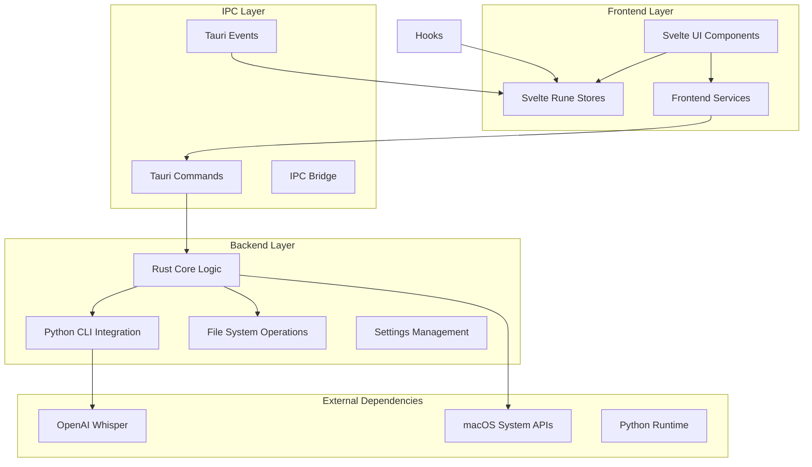
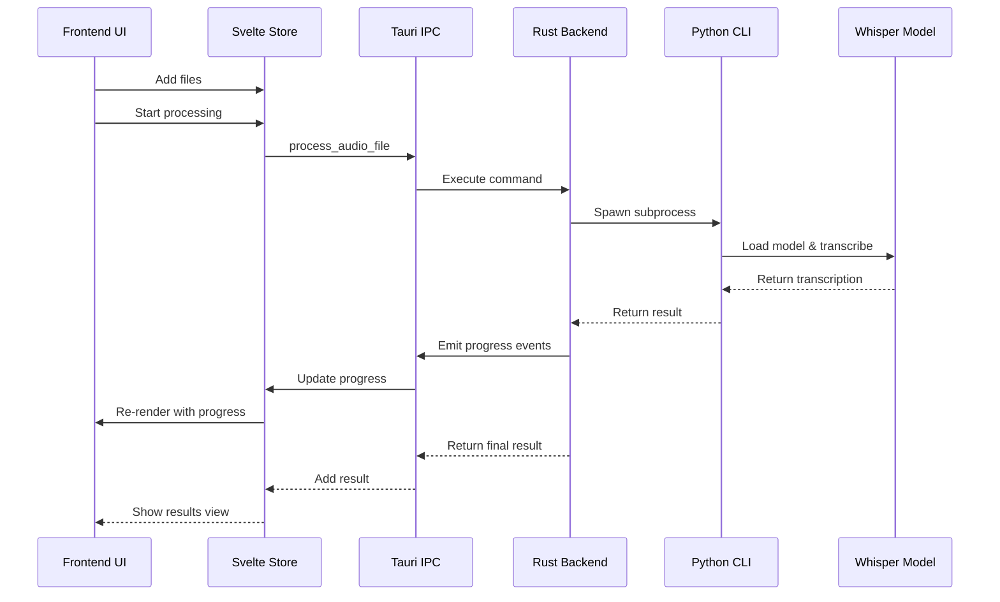

# Architecture Documentation

This document provides a comprehensive overview of the Speech to Text application architecture, design decisions, and implementation details.

## High-Level Architecture

### System Overview

The Speech to Text application follows a modern desktop application architecture using Tauri, which combines a Rust backend with a Svelte frontend through secure IPC (Inter-Process Communication).



### Technology Stack

#### Frontend Stack
- **Svelte 5**: Modern reactive framework with runes
- **TypeScript**: Type-safe JavaScript with strict mode
- **Tailwind CSS**: Utility-first CSS framework
- **Svelte Rune Stores**: Built-in reactive state management
- **Vite**: Fast build tool and development server
- **Vitest**: Unit testing framework

#### Backend Stack
- **Rust**: Systems programming language for performance and safety
- **Tauri**: Desktop application framework
- **Tokio**: Async runtime for Rust
- **Serde**: Serialization/deserialization framework
- **Thiserror**: Error handling library

#### Integration Layer
- **Python CLI**: Existing speech-to-text command-line interface
- **OpenAI Whisper**: AI model for speech recognition
- **macOS APIs**: Native system integration

## Design Principles

### 1. Security First
- **Sandboxed Execution**: Tauri provides secure sandboxing
- **Minimal Permissions**: Request only necessary system permissions
- **Local Processing**: No data leaves the user's device
- **Secure IPC**: Type-safe communication between frontend and backend

### 2. Performance Optimization
- **Async Operations**: Non-blocking UI during processing
- **Memory Efficiency**: Careful memory management for large files
- **Resource Management**: Prevent system overload
- **Lazy Loading**: Load components and resources on demand

### 3. User Experience
- **Native Feel**: Platform-specific UI patterns
- **Accessibility**: Full keyboard navigation and screen reader support
- **Responsive Design**: Adapts to different window sizes
- **Error Recovery**: Graceful error handling and recovery

### 4. Maintainability
- **Type Safety**: Comprehensive TypeScript and Rust typing
- **Modular Design**: Clear separation of concerns
- **Testing**: Comprehensive test coverage
- **Documentation**: Extensive code and API documentation

## Project Structure

### Directory Organization

```
tauri-gui-app/
├── src/                           # Svelte frontend source
│   ├── components/                # Svelte components
│   │   ├── ui/                   # Reusable UI components
│   │   ├── views/                # Main application views
│   │   ├── processing/           # Processing-related components
│   │   ├── error/                # Error handling components
│   │   └── diagnostics/          # System diagnostics components
│   ├── stores/                   # Svelte rune stores
│   ├── services/                 # Frontend service layer
│   ├── utils/                    # Utility functions
│   ├── types/                    # TypeScript type definitions
│   └── styles/                   # CSS and styling
├── src-tauri/                    # Rust backend source
│   ├── src/                      # Rust source code
│   │   ├── commands/             # Tauri command handlers
│   │   ├── models/               # Data models and types
│   │   ├── services/             # Backend service layer
│   │   ├── utils/                # Utility functions
│   │   └── integrations/         # External integrations
│   ├── capabilities/             # Tauri capabilities configuration
│   ├── icons/                    # Application icons
│   └── tests/                    # Rust integration tests
├── docs/                         # Documentation
├── scripts/                      # Build and utility scripts
└── tests/                        # End-to-end tests
```

### Component Architecture

#### Frontend Components Hierarchy

```
App
├── ErrorBoundary
├── AccessibilityProvider
├── ThemeProvider
└── Router
    ├── UploadView
    │   ├── FileUpload
    │   ├── FileList
    │   └── SettingsPanel
    ├── ProcessingView
    │   ├── ProgressMonitor
    │   ├── StageIndicator
    │   ├── TimeEstimation
    │   └── ProcessingLog
    ├── ResultsView
    │   ├── TextEditor
    │   ├── ExportDialog
    │   └── MetadataPanel
    └── BatchView
        ├── BatchFileList
        ├── BatchProgress
        └── BatchResults
```

## Data Flow Architecture

### State Management

The application uses Svelte 5 runes for state management with reactive stores:

```typescript
// appStore.svelte.ts
class AppStore {
  files = $state<AudioFile[]>([]);
  currentProcessing = $state<ProcessingJob | null>(null);
  processingQueue = $state<ProcessingJob[]>([]);
  results = $state<TranscriptionResult[]>([]);
  settings = $state<AppSettings>(defaultSettings);
  currentView = $state<ViewType>('upload');
  errors = $state<AppError[]>([]);

  addFiles(files: File[]) {
    this.files.push(...files.map(createAudioFile));
  }

  removeFile(id: string) {
    this.files = this.files.filter(f => f.id !== id);
  }

  updateProgress(progress: ProcessingProgress) {
    // Update reactive state
  }
}

export const appStore = new AppStore();
```

### IPC Communication

Communication between frontend and backend uses Tauri's command system:

```rust
// Rust command definition
#[tauri::command]
async fn process_audio_file(
    file_path: String,
    settings: AppSettings,
    window: tauri::Window,
) -> Result<TranscriptionResult, String> {
    // Implementation
}

// TypeScript usage
import { invoke } from '@tauri-apps/api/tauri';

const result = await invoke<TranscriptionResult>('process_audio_file', {
  filePath: '/path/to/file.m4a',
  settings: currentSettings,
});
```

### Event System

Real-time updates use Tauri's event system:

```rust
// Rust event emission
window.emit("processing_progress", ProcessingProgress {
    file_id: "123".to_string(),
    progress: 0.75,
    stage: ProcessingStage::Transcribing,
})?;
```

```typescript
// TypeScript event listening
import { listen } from '@tauri-apps/api/event';

const unlisten = await listen<ProcessingProgress>('processing_progress', (event) => {
  updateProgress(event.payload);
});
```

## Core Components

### 1. File Processing Pipeline

#### Processing Flow


#### File Validation
```rust
pub struct FileValidator;

impl FileValidator {
    pub fn validate_audio_file(path: &Path) -> Result<AudioFileInfo, ValidationError> {
        // Check file existence
        if !path.exists() {
            return Err(ValidationError::FileNotFound);
        }
        
        // Check file format
        let extension = path.extension()
            .and_then(|ext| ext.to_str())
            .ok_or(ValidationError::InvalidFormat)?;
            
        match extension.to_lowercase().as_str() {
            "m4a" | "wav" | "mp3" | "aac" | "flac" => {},
            _ => return Err(ValidationError::UnsupportedFormat(extension.to_string())),
        }
        
        // Check file size
        let metadata = fs::metadata(path)?;
        if metadata.len() > MAX_FILE_SIZE {
            return Err(ValidationError::FileTooLarge);
        }
        
        Ok(AudioFileInfo {
            path: path.to_path_buf(),
            size: metadata.len(),
            format: extension.to_string(),
        })
    }
}
```

### 2. Settings Management

#### Configuration System
```rust
#[derive(Debug, Serialize, Deserialize, Clone)]
pub struct AppSettings {
    pub language: String,
    pub model_size: ModelSize,
    pub output_directory: PathBuf,
    pub include_metadata: bool,
    pub auto_save: bool,
    pub theme: Theme,
    pub performance: PerformanceSettings,
}

impl AppSettings {
    pub fn load() -> Result<Self, SettingsError> {
        let config_path = Self::config_path()?;
        
        if config_path.exists() {
            let content = fs::read_to_string(&config_path)?;
            let settings: AppSettings = serde_json::from_str(&content)?;
            Ok(settings)
        } else {
            Ok(Self::default())
        }
    }
    
    pub fn save(&self) -> Result<(), SettingsError> {
        let config_path = Self::config_path()?;
        
        if let Some(parent) = config_path.parent() {
            fs::create_dir_all(parent)?;
        }
        
        let content = serde_json::to_string_pretty(self)?;
        fs::write(&config_path, content)?;
        
        Ok(())
    }
}
```

### 3. Error Handling System

#### Error Types Hierarchy
```rust
#[derive(Debug, thiserror::Error)]
pub enum AppError {
    #[error("File operation failed: {0}")]
    FileError(#[from] std::io::Error),
    
    #[error("Processing failed: {message}")]
    ProcessingError { message: String },
    
    #[error("CLI execution failed: {0}")]
    CliError(String),
    
    #[error("Settings error: {0}")]
    SettingsError(#[from] SettingsError),
    
    #[error("Validation failed: {0}")]
    ValidationError(#[from] ValidationError),
}

impl AppError {
    pub fn user_message(&self) -> String {
        match self {
            AppError::FileError(_) => "File operation failed. Please check file permissions.".to_string(),
            AppError::ProcessingError { message } => format!("Processing failed: {}", message),
            AppError::CliError(_) => "Speech recognition failed. Please try again.".to_string(),
            AppError::SettingsError(_) => "Settings could not be saved. Please check permissions.".to_string(),
            AppError::ValidationError(e) => e.user_message(),
        }
    }
    
    pub fn is_recoverable(&self) -> bool {
        match self {
            AppError::FileError(_) => false,
            AppError::ProcessingError { .. } => true,
            AppError::CliError(_) => true,
            AppError::SettingsError(_) => true,
            AppError::ValidationError(_) => false,
        }
    }
}
```

## Integration Patterns

### 1. Python CLI Integration

#### Subprocess Management
```rust
use tokio::process::Command;
use tokio::io::{AsyncBufReadExt, BufReader};

pub struct CliIntegration {
    cli_path: PathBuf,
}

impl CliIntegration {
    pub async fn process_file(
        &self,
        file_path: &Path,
        settings: &AppSettings,
        progress_callback: impl Fn(ProcessingProgress),
    ) -> Result<TranscriptionResult, CliError> {
        let mut cmd = Command::new(&self.cli_path);
        cmd.arg(file_path)
           .arg("--language").arg(&settings.language)
           .arg("--model-size").arg(&settings.model_size.to_string())
           .arg("--output-dir").arg(&settings.output_directory)
           .arg("--progress")
           .stdout(Stdio::piped())
           .stderr(Stdio::piped());
        
        let mut child = cmd.spawn()?;
        
        // Monitor stdout for progress updates
        if let Some(stdout) = child.stdout.take() {
            let reader = BufReader::new(stdout);
            let mut lines = reader.lines();
            
            while let Some(line) = lines.next_line().await? {
                if let Ok(progress) = self.parse_progress_line(&line) {
                    progress_callback(progress);
                }
            }
        }
        
        let output = child.wait_with_output().await?;
        
        if output.status.success() {
            self.parse_result(&output.stdout)
        } else {
            let error = String::from_utf8_lossy(&output.stderr);
            Err(CliError::ExecutionFailed(error.to_string()))
        }
    }
}
```

### 2. System Integration

#### macOS Native Features
```rust
#[cfg(target_os = "macos")]
pub mod macos {
    use cocoa::appkit::NSWorkspace;
    use cocoa::base::nil;
    use cocoa::foundation::NSString;
    
    pub fn reveal_in_finder(path: &Path) -> Result<(), SystemError> {
        unsafe {
            let workspace = NSWorkspace::sharedWorkspace(nil);
            let path_str = NSString::alloc(nil).init_str(&path.to_string_lossy());
            workspace.selectFile_inFileViewerRootedAtPath(path_str, nil);
        }
        Ok(())
    }
    
    pub fn set_file_association(extension: &str) -> Result<(), SystemError> {
        // Implementation for setting file associations
        Ok(())
    }
}
```

## Testing Architecture

### Testing Strategy

#### 1. Unit Tests
```rust
#[cfg(test)]
mod tests {
    use super::*;
    use tempfile::TempDir;
    
    #[tokio::test]
    async fn test_file_validation() {
        let temp_dir = TempDir::new().unwrap();
        let test_file = temp_dir.path().join("test.m4a");
        fs::write(&test_file, b"fake audio data").unwrap();
        
        let result = FileValidator::validate_audio_file(&test_file);
        assert!(result.is_ok());
    }
    
    #[tokio::test]
    async fn test_settings_persistence() {
        let temp_dir = TempDir::new().unwrap();
        let settings = AppSettings::default();
        
        // Test saving
        settings.save_to_path(temp_dir.path()).unwrap();
        
        // Test loading
        let loaded = AppSettings::load_from_path(temp_dir.path()).unwrap();
        assert_eq!(settings, loaded);
    }
}
```

#### 2. Integration Tests
```typescript
import { describe, it, expect, beforeEach } from 'vitest';
import { render, screen, fireEvent, waitFor } from '@testing-library/svelte';
import App from '../App.svelte';

describe('File Upload Integration', () => {
  beforeEach(() => {
    // Setup test environment
  });
  
  it('should handle file upload and processing', async () => {
    render(App);
    
    const uploadArea = screen.getByTestId('file-upload-area');
    const file = new File(['audio data'], 'test.m4a', { type: 'audio/m4a' });
    
    fireEvent.drop(uploadArea, {
      dataTransfer: { files: [file] }
    });
    
    await waitFor(() => {
      expect(screen.getByText('test.m4a')).toBeInTheDocument();
    });
    
    const processButton = screen.getByText('Start Processing');
    fireEvent.click(processButton);
    
    await waitFor(() => {
      expect(screen.getByTestId('progress-bar')).toBeInTheDocument();
    });
  });
});
```

#### 3. End-to-End Tests
```typescript
import { test, expect } from '@playwright/test';

test('complete transcription workflow', async ({ page }) => {
  await page.goto('/');
  
  // Upload file
  const fileInput = page.locator('input[type="file"]');
  await fileInput.setInputFiles('test-audio.m4a');
  
  // Start processing
  await page.click('text=Start Processing');
  
  // Wait for completion
  await page.waitForSelector('text=Transcription Complete');
  
  // Verify results
  const transcription = page.locator('[data-testid="transcription-text"]');
  await expect(transcription).toContainText('expected transcription content');
  
  // Test export
  await page.click('text=Export');
  await page.click('text=Plain Text');
  
  // Verify download
  const download = await page.waitForEvent('download');
  expect(download.suggestedFilename()).toBe('test-audio.txt');
});
```

## Performance Considerations

### Memory Management

#### Efficient File Handling
```rust
pub struct FileProcessor {
    max_memory_usage: usize,
    current_memory_usage: Arc<AtomicUsize>,
}

impl FileProcessor {
    pub async fn process_large_file(&self, path: &Path) -> Result<(), ProcessingError> {
        // Check memory usage before processing
        let current_usage = self.current_memory_usage.load(Ordering::Relaxed);
        if current_usage > self.max_memory_usage {
            return Err(ProcessingError::InsufficientMemory);
        }
        
        // Stream processing for large files
        let file = File::open(path).await?;
        let mut reader = BufReader::new(file);
        let mut buffer = vec![0; 8192]; // 8KB chunks
        
        while let Ok(bytes_read) = reader.read(&mut buffer).await {
            if bytes_read == 0 { break; }
            
            // Process chunk
            self.process_chunk(&buffer[..bytes_read]).await?;
            
            // Update memory usage
            self.current_memory_usage.fetch_add(bytes_read, Ordering::Relaxed);
        }
        
        Ok(())
    }
}
```

### Async Processing

#### Background Task Management
```rust
use tokio::sync::Semaphore;

pub struct TaskManager {
    semaphore: Arc<Semaphore>,
    active_tasks: Arc<Mutex<HashMap<String, JoinHandle<()>>>>,
}

impl TaskManager {
    pub fn new(max_concurrent: usize) -> Self {
        Self {
            semaphore: Arc::new(Semaphore::new(max_concurrent)),
            active_tasks: Arc::new(Mutex::new(HashMap::new())),
        }
    }
    
    pub async fn spawn_processing_task<F, Fut>(
        &self,
        task_id: String,
        task: F,
    ) -> Result<(), TaskError>
    where
        F: FnOnce() -> Fut + Send + 'static,
        Fut: Future<Output = Result<(), ProcessingError>> + Send,
    {
        let permit = self.semaphore.acquire().await?;
        let active_tasks = self.active_tasks.clone();
        let task_id_clone = task_id.clone();
        
        let handle = tokio::spawn(async move {
            let _permit = permit; // Keep permit alive
            
            if let Err(e) = task().await {
                eprintln!("Task {} failed: {}", task_id_clone, e);
            }
            
            // Remove from active tasks
            active_tasks.lock().await.remove(&task_id_clone);
        });
        
        self.active_tasks.lock().await.insert(task_id, handle);
        Ok(())
    }
}
```

## Security Architecture

### Sandboxing and Permissions

#### Tauri Security Configuration
```json
{
  "tauri": {
    "allowlist": {
      "all": false,
      "fs": {
        "all": false,
        "readFile": true,
        "writeFile": true,
        "readDir": true,
        "createDir": true,
        "scope": ["$DOCUMENT/*", "$DOWNLOAD/*"]
      },
      "dialog": {
        "all": false,
        "open": true,
        "save": true
      },
      "shell": {
        "all": false,
        "execute": true,
        "scope": [
          {
            "name": "speech-to-text-cli",
            "cmd": "speech-to-text",
            "args": true
          }
        ]
      }
    }
  }
}
```

#### Input Validation
```rust
pub fn validate_file_path(path: &str) -> Result<PathBuf, ValidationError> {
    let path = PathBuf::from(path);
    
    // Prevent path traversal
    if path.components().any(|c| matches!(c, Component::ParentDir)) {
        return Err(ValidationError::PathTraversal);
    }
    
    // Ensure path is within allowed directories
    let canonical = path.canonicalize()
        .map_err(|_| ValidationError::InvalidPath)?;
    
    if !is_path_allowed(&canonical) {
        return Err(ValidationError::UnauthorizedPath);
    }
    
    Ok(canonical)
}
```

## Monitoring and Observability

### Logging System

#### Structured Logging
```rust
use tracing::{info, warn, error, instrument};

#[instrument(skip(file_data))]
pub async fn process_audio_file(
    file_path: &Path,
    file_data: &[u8],
    settings: &AppSettings,
) -> Result<TranscriptionResult, ProcessingError> {
    info!(
        file_path = %file_path.display(),
        file_size = file_data.len(),
        model_size = %settings.model_size,
        "Starting audio file processing"
    );
    
    let start_time = Instant::now();
    
    match perform_transcription(file_data, settings).await {
        Ok(result) => {
            let duration = start_time.elapsed();
            info!(
                processing_time = ?duration,
                transcription_length = result.text.len(),
                "Processing completed successfully"
            );
            Ok(result)
        }
        Err(e) => {
            error!(
                error = %e,
                processing_time = ?start_time.elapsed(),
                "Processing failed"
            );
            Err(e)
        }
    }
}
```

### Performance Metrics

#### Metrics Collection
```rust
use std::sync::atomic::{AtomicU64, Ordering};

pub struct Metrics {
    files_processed: AtomicU64,
    total_processing_time: AtomicU64,
    errors_count: AtomicU64,
}

impl Metrics {
    pub fn record_processing(&self, duration: Duration) {
        self.files_processed.fetch_add(1, Ordering::Relaxed);
        self.total_processing_time.fetch_add(
            duration.as_millis() as u64,
            Ordering::Relaxed
        );
    }
    
    pub fn record_error(&self) {
        self.errors_count.fetch_add(1, Ordering::Relaxed);
    }
    
    pub fn get_stats(&self) -> ProcessingStats {
        let files = self.files_processed.load(Ordering::Relaxed);
        let total_time = self.total_processing_time.load(Ordering::Relaxed);
        let errors = self.errors_count.load(Ordering::Relaxed);
        
        ProcessingStats {
            files_processed: files,
            average_processing_time: if files > 0 { total_time / files } else { 0 },
            error_rate: if files > 0 { (errors as f64 / files as f64) * 100.0 } else { 0.0 },
        }
    }
}
```

## Deployment Architecture

### Build Pipeline

#### Multi-target Builds
```yaml
# GitHub Actions workflow
name: Build and Release

on:
  push:
    tags: ['v*']

jobs:
  build:
    strategy:
      matrix:
        platform: [macos-latest]
        arch: [x86_64, aarch64]
    
    runs-on: ${{ matrix.platform }}
    
    steps:
      - uses: actions/checkout@v3
      
      - name: Setup Node.js
        uses: actions/setup-node@v3
        with:
          node-version: 18
          
      - name: Setup Rust
        uses: actions-rs/toolchain@v1
        with:
          toolchain: stable
          target: ${{ matrix.arch }}-apple-darwin
          
      - name: Install dependencies
        run: npm ci
        
      - name: Build application
        run: npm run build:${{ matrix.arch }}
        
      - name: Sign and notarize (macOS)
        if: matrix.platform == 'macos-latest'
        run: |
          codesign --deep --force --verify --verbose --sign "$APPLE_CERTIFICATE" "target/release/bundle/macos/Speech to Text.app"
          xcrun notarytool submit "target/release/bundle/macos/Speech to Text.dmg" --keychain-profile "notarytool-profile" --wait
```

### Distribution Strategy

#### Release Management
```rust
// Automatic update system
pub struct UpdateManager {
    current_version: Version,
    update_url: String,
}

impl UpdateManager {
    pub async fn check_for_updates(&self) -> Result<Option<UpdateInfo>, UpdateError> {
        let response = reqwest::get(&self.update_url).await?;
        let latest: ReleaseInfo = response.json().await?;
        
        if latest.version > self.current_version {
            Ok(Some(UpdateInfo {
                version: latest.version,
                download_url: latest.download_url,
                changelog: latest.changelog,
            }))
        } else {
            Ok(None)
        }
    }
}
```

This architecture documentation provides a comprehensive overview of the system design, implementation patterns, and best practices used in the Speech to Text application. It serves as a guide for developers working on the project and helps maintain consistency across the codebase.